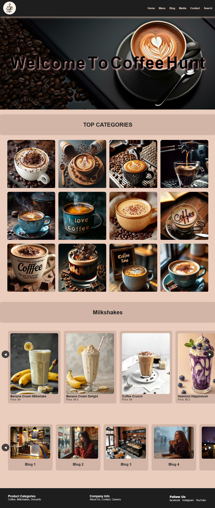

## Upload Date: 02 February 2026

# Coffee Web

A modern and stylish coffee shop website built using HTML, CSS, and JavaScript, featuring smooth animations, sliders, and a clean UI design.



---

## Features

- Attractive navbar with logo and menu
- Animated cover text (letter rotation and floating effect)
- Top categories section with hover effects
- Milkshake slider with drag-to-scroll and navigation buttons
- Blog slider section
- Fully responsive design
- Clean color palette and smooth hover animations
- Hidden scrollbar for better UI

---

## Technologies Used

- HTML5
- CSS3
- JavaScript (Vanilla JS)

---

## Project Structure

## 📂 Project Structure
```
Coffee-Web/
│
├── Web open code.html
├── fff.css
└── funtion.js
```


---

## Update — 02 March 2026 (Website UI Development)

This update focuses on improving UI design, responsiveness, and user interaction across the Coffee Website.

### Planned Improvements

- Improve 3D carousel responsiveness
- Implement smooth scroll navigation from navbar
- Add modal view for product images
- Fix cover text animation on small screens

---

## Web UI Demo

<p align="center">
  <a href="https://youtu.be/izthVyBzmTU">
    
  </a>
</p>

This demo showcases the latest UI updates and interaction improvements.

---

## Author

MH Hridoy  
https://github.com/mhhridoy7907
⭐ This demo video showcases the latest UI updates and interaction improvements of the Coffee Website.

