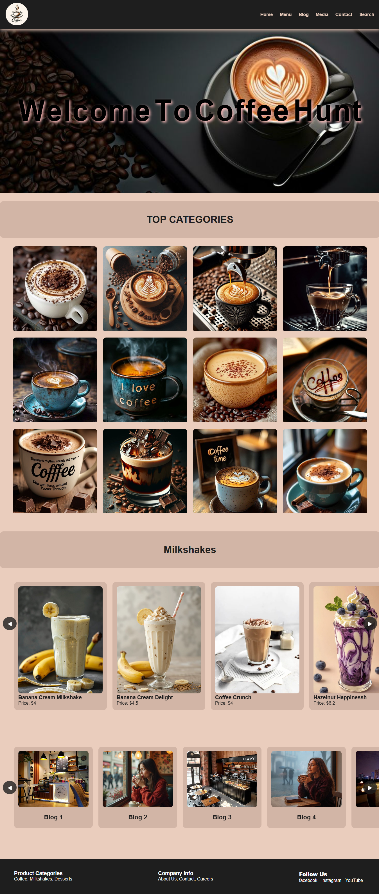

# ☕ Coffee Web

A modern and stylish coffee shop website built with **HTML, CSS, and Vanilla JavaScript**, featuring smooth animations, interactive sliders, a 3D coffee carousel, responsive layouts, and a clean user interface.

> 🚀 **Current Development:** The project is now being upgraded from a **static website to a fully dynamic coffee shop platform** with an admin management system and database integration.



---

## 📅 Upload Date

**02 February 2026**

The original version of Coffee Web was developed as a static front-end project focused on UI design, animations, responsiveness, and interactive JavaScript features.

---

## ✨ Features

### Current Static Version

- Attractive navigation bar with logo and menu
- Animated cover section
- 3D coffee image carousel
- Milkshake horizontal slider
- Drag-to-scroll functionality
- Previous/Next navigation buttons
- Blog slider section
- Product cards with pricing
- Search functionality
- Image preview modal
- Order interface
- Smooth scrolling
- Responsive design for desktop and mobile
- Hidden scrollbars for a cleaner UI
- Smooth hover and interaction animations
- Clean coffee-inspired color palette

---

## 🚀 Dynamic Development

### Dynamic Upgrade Started — 07 October 2026

Today, the project has entered a new development phase:

**Static Website → Dynamic Coffee Shop Platform**

The goal is to make the website content manageable without manually editing the HTML code.

### Planned Dynamic Features

- 🔐 Admin dashboard
- ➕ Add products from Admin Panel
- ✏️ Edit products
- 🗑️ Delete products
- 🖼️ Upload product images
- ➕ Add and manage blogs
- ✏️ Edit blog information
- 🗑️ Delete blogs
- 🖼️ Manage 3D carousel images
- 📦 Customer order management
- 🔄 Dynamic product rendering
- 🔍 Dynamic search
- 📊 Admin dashboard statistics
- 💾 Database-based content management
- 🔥 Firebase integration
- 🔐 Secure admin authentication
- ☁️ Firebase Storage for image uploads

> **Development Goal:** Transform Coffee Web from a front-end static project into a complete, database-powered coffee shop web application.

---

## 🛠️ Technologies Used

### Current

- HTML5
- CSS3
- JavaScript
- Vanilla JavaScript
- LocalStorage

### Dynamic Development

- Firebase Realtime Database
- Firebase Storage
- Firebase Authentication
- Vanilla JavaScript

> Firebase configuration/API credentials will be added during the database integration phase.

---

## 📂 Project Structure

```text
Coffee-Web/
│
├── index.html
├── admin.html
├── fff.css
└── funtion.js
```

### Current Architecture

```text
index.html
     │
     ├── Website UI
     ├── Products
     ├── Blogs
     ├── Carousel
     └── Orders
             │
             ▼
       JavaScript
             │
             ▼
        LocalStorage
```

### Planned Architecture

```text
                 ┌─────────────────┐
                 │   Admin Panel   │
                 │   admin.html    │
                 └────────┬────────┘
                          │
                   Add / Edit / Delete
                          │
                          ▼
              ┌──────────────────────┐
              │ Firebase Realtime DB │
              └──────────┬───────────┘
                         │
                         ▼
                 ┌───────────────┐
                 │   Website     │
                 │   index.html  │
                 └───────────────┘

              Firebase Storage
                     │
                     ▼
               Image Uploads
```

---

## 🎨 UI Development

The original project focused primarily on front-end design and user interaction.

The UI includes:

- Responsive layouts
- Interactive cards
- Smooth animations
- 3D carousel
- Horizontal sliders
- Drag interactions
- Search interface
- Image modal
- Order interface

The dynamic upgrade will preserve the existing visual design while replacing hard-coded content with database-driven content.

---

## 🎥 Web UI Demo

<p align="center">
  <a href="https://youtu.be/izthVyBzmTU">
    
  </a>
</p>

This demo showcases the earlier UI development, animations, sliders, responsiveness, and interaction improvements of the Coffee Website.

---

## 📌 Development Timeline

| Date | Development Stage |
|---|---|
| **02 February 2026** | ☕ Initial project uploaded |
| **02 March 2026** | 🎨 UI and interaction improvements |
| **07 October 2026** | 🚀 Static → Dynamic development started |
| **Next Phase** | 🔥 Firebase database integration |
| **Future** | 🔐 Admin authentication & content management |
| **Future** | ☁️ Image upload & storage system |
| **Future** | 📦 Complete dynamic order management |

---

## 👨‍💻 Author

**MH Hridoy**

Coffee Web is an ongoing development project focused on transforming a static coffee shop UI into a complete dynamic web application.

⭐ From a simple static UI to a database-powered coffee platform.